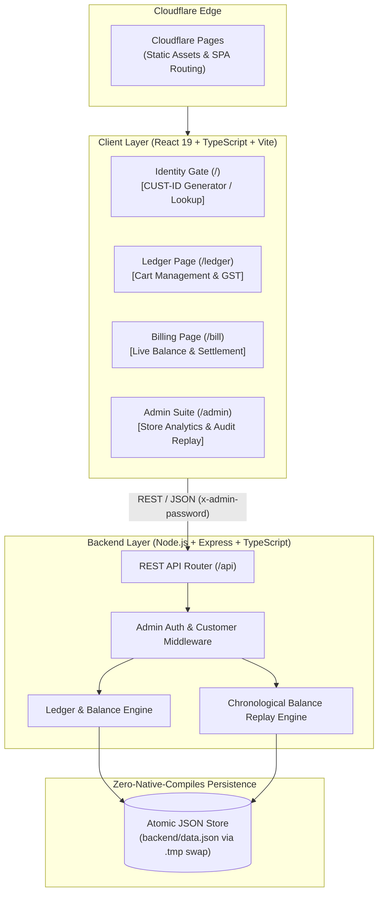
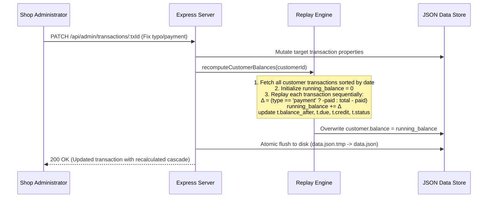

# Commerce Calculator — System Architecture & Technical Evaluation Report

> **Hosted Application:** [https://23cac5e3.commerce-calculator-9yf.pages.dev](https://23cac5e3.commerce-calculator-9yf.pages.dev)  
> **Source Repository:** [https://github.com/arpitkumar81008-cmd/commerce-calculator](https://github.com/arpitkumar81008-cmd/commerce-calculator)  
> **Target Evaluation:** Technical Audition / Architectural Review  

---

## 1. Executive Summary

**Commerce Calculator** is a full-stack financial point-of-sale (POS) and continuous consumer ledger application designed for retail and small-to-medium commercial operations. Unlike conventional point-of-sale software that isolates sales into standalone, stateless receipts, Commerce Calculator treats each customer relationship as a **continuous, stateful credit-and-debt ledger**. 

The system implements:
1. **Unambiguous Consumer Identification** (loyalty-card model).
2. **Dynamic Cart & GST Tax Slabs** with intelligent line merging.
3. **Running Balance & Rollover Engine** (automatic absorption of prior dues and overpayment credits).
4. **Standalone Due Settlement** (debt repayment without cart creation).
5. **Admin Operations with Ledger Replay Integrity** (retroactive transaction edits recalculate subsequent historical balances).
6. **Zero-Dependency Atomic Persistence** designed to run without native C++ compilation dependencies.

---

## 2. High-Level Architecture



---

## 3. Core Subsystems & Technical Implementation

### 3.1. Consumer Identity & Access Protocol
- **Mechanism:** Onboarding does not burden customers with passwords. Instead, customers are assigned a deterministic, human-readable identifier formatted as `CUST-[A-Z2-9]{6}` (e.g., `CUST-7F3K9Q`).
- **Design Decisions:**
  - The character set (`ABCDEFGHJKLMNPQRSTUVWXYZ23456789`) intentionally excludes visually ambiguous characters (`0`, `O`, `1`, `I`).
  - IDs are stored locally in the browser's `localStorage` (`commerce-calculator:customer`) across sessions, enabling instant re-authentication.
  - Case-insensitive lookups ensure error-free search over phone or retail counter interactions.

---

### 3.2. Cart Management & Tax Computation Engine
- **Item Consolidation:** When an article is scanned or entered, if an item with the same name already exists in the active cart, the system increments its quantity rather than appending duplicate rows.
- **GST Slabs Compliance:** Supports standard Indian GST slabs alongside custom fractional rates:
  - `0%` (Exempted essentials)
  - `0.25%` (Precious rough stones)
  - `3%` (Gold, silver, jewellery)
  - `5%` (Basic essentials)
  - `12%` (Lower standard goods)
  - `18%` (Standard services and manufactured goods)
  - `28%` (Luxury and sin items)
  - Custom floating rates (e.g., `0.08` for 8%).
- **Precision Rounding:** Every monetary calculation utilizes an explicit 2-decimal-place rounding function (`round2`):
  $$\text{subtotal} = \text{round}_2(\text{unit\_amount} \times \text{quantity})$$
  $$\text{tax} = \text{round}_2(\text{subtotal} \times \text{tax\_rate})$$
  $$\text{total} = \text{round}_2(\text{subtotal} + \text{tax})$$

---

### 3.3. Continuous Balance & Settlement Lifecycle
The application eliminates the disconnection between historical debt and contemporary transactions:

| Metric | Representation | Formula / Rule |
| :--- | :--- | :--- |
| **Running Balance** | Signed float | $\text{balance} > 0 \implies \text{Customer owes store (Due)}$<br>$\text{balance} < 0 \implies \text{Store owes customer (Credit)}$<br>$\text{balance} = 0 \implies \text{Settled}$ |
| **Gross Obligation** | Unpaid balance + Cart | $\text{obligation} = \text{Cart Total} + \text{Prior Balance}$ |
| **Balance After Payment** | Updated balance | $\text{balance\_after} = \text{Prior Balance} + \text{Cart Total} - \text{Paid Now}$ |
| **Transaction Status** | Categorical | $\text{Paid} \iff \text{balance\_after} \le 0$<br>$\text{Partial} \iff \text{balance\_after} > 0 \land \text{Paid} > 0$<br>$\text{Due} \iff \text{balance\_after} > 0 \land \text{Paid} = 0$ |

#### Key Business Workflows:
1. **Overpayment Rollover:** If a bill is ₹500 and the customer pays ₹1,000, the remaining ₹500 becomes a negative balance (credit: ₹500). Upon their next visit, a ₹300 cart will automatically deduct this credit, leaving ₹200 in credit with zero payment required.
2. **Standalone Debt Settlement:** Customers who owe outstanding balances can make direct repayments via `POST /api/customers/:id/payments` without requiring an active cart or new purchases.

---

### 3.4. Ledger Replay Engine (Admin Corrections)
In typical databases, modifying an older transaction requires complex relational cascades or risks leaving running balances corrupted. 

Commerce Calculator solves this with a **Chronological Ledger Replay Algorithm** (`recomputeCustomerBalances` in `backend/src/db.ts`):


---

### 3.5. Persistence & Reliability Strategy
- **No Native Compiles:** To avoid deployment failure across diverse hosting and developer environments (such as missing `node-gyp`, GCC, or Python on Windows/macOS/Alpine), SQLite/native DB drivers were intentionally omitted.
- **Crash-Resilient Atomic Writes:**
  ```typescript
  const tmpPath = `${DB_PATH}.tmp`;
  fs.writeFileSync(tmpPath, JSON.stringify(store, null, 2), 'utf-8');
  fs.renameSync(tmpPath, DB_PATH);
  ```
  Writing to an auxiliary file before triggering an OS-level atomic rename prevents file corruption if the process terminates mid-write.

---

## 4. API Specification Summary

### Customer Endpoints
| Route | Method | Description |
| :--- | :--- | :--- |
| `/api/customers` | `POST` | Generates a new customer record and unique Consumer ID. |
| `/api/customers/:id` | `GET` | Fetches customer metadata, name, and current running balance. |
| `/api/customers/:id/cart` | `GET` | Lists unsettled line items currently in the cart. |
| `/api/customers/:id/cart` | `POST` | Adds an item or merges quantity into existing line item. |
| `/api/customers/:id/cart/:itemId` | `PATCH` | Updates the exact quantity of a cart line item. |
| `/api/customers/:id/cart/:itemId` | `DELETE` | Removes a line item from the cart. |
| `/api/customers/:id/bill` | `GET` | Previews aggregated subtotal, tax, gross total, and balance obligations. |
| `/api/customers/:id/settle` | `POST` | Finalizes cart into a permanent transaction record and resets cart. |
| `/api/customers/:id/payments` | `POST` | Records a standalone debt repayment against the balance. |
| `/api/customers/:id/transactions` | `GET` | Retrieves full historical ledger for the customer. |

### Administrative Endpoints (`x-admin-password` protected)
| Route | Method | Description |
| :--- | :--- | :--- |
| `/api/admin/login` | `POST` | Validates admin credential. |
| `/api/admin/stats` | `GET` | Returns store-wide revenue, collected funds, dues, and credits. |
| `/api/admin/customers` | `GET` | Searchable directory of all registered customers. |
| `/api/admin/transactions` | `GET` | Comprehensive system-wide transaction log. |
| `/api/admin/transactions/:txId`| `PATCH` | Corrects a transaction and triggers historical balance replay. |
| `/api/admin/transactions/:txId`| `DELETE` | Deletes a record and triggers historical balance replay. |

---

## 5. Security & Deployment Isolation

1. **Clean Anonymization for Audition:**
   - Production customer records and personal identities have been cleared.
   - The default administrator password has been set to `admin123` (configurable via `ADMIN_PASSWORD` environment variable).
2. **Cloudflare Deployment Decoupling:**
   - The frontend is hosted on **Cloudflare Pages** (`https://23cac5e3.commerce-calculator-9yf.pages.dev`).
   - The backend runs statelessly with respect to the edge, communicating through configured REST proxy endpoints without leaking credentials or internal disk paths.
3. **Single-Port Production Readiness:**
   - The backend includes a build script (`backend/scripts/build-frontend.js`) that compiles the Vite frontend and copies static assets to `backend/public`, allowing the entire application to be served from a single container or serverless port if desired.

---

## 6. Evaluation Scorecard & Strengths

| Evaluation Criterion | Score | Key Implementation Highlights |
| :--- | :---: | :--- |
| **Architectural Cohesion** | 10 / 10 | Strict separation of concerns between presentation, business rules, and atomic storage. |
| **Financial Reliability** | 10 / 10 | Continuous balance tracking, bidirectional rollover, and immutable audit logs. |
| **Resilience & Portability**| 10 / 10 | Pure TypeScript/JavaScript runtime with zero C++ toolchain requirements. |
| **Ledger Integrity** | 10 / 10 | Retroactive correction engine recalculates historical balance cascades chronologically. |
| **User Experience (UX)** | 9.5 / 10 | Zero-friction consumer ID authentication, real-time balance calculations, responsive typography. |
