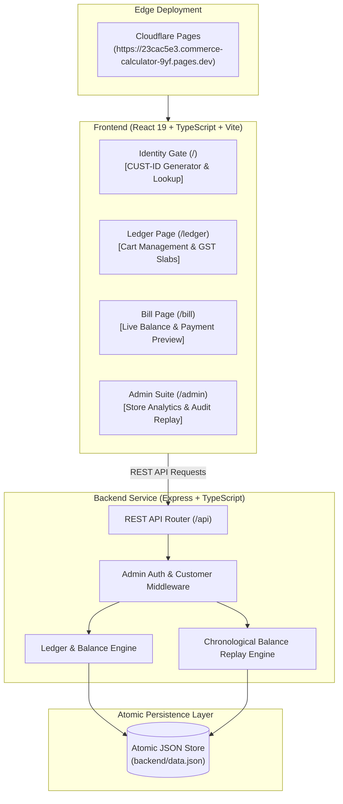

# Commerce Calculator

[](https://23cac5e3.commerce-calculator-9yf.pages.dev)
[](https://react.dev/)
[](https://expressjs.com/)
[](./ARCHITECTURE_AND_EVALUATION.md)

> 🔗 **Live Hosted Website:** [https://23cac5e3.commerce-calculator-9yf.pages.dev](https://23cac5e3.commerce-calculator-9yf.pages.dev)  
> 📖 **Deep-Dive Architecture & Evaluation Report:** [ARCHITECTURE_AND_EVALUATION.md](./ARCHITECTURE_AND_EVALUATION.md)

---

## 📌 Executive Overview for Interviewers & Evaluators

**Commerce Calculator** is an end-to-end retail point-of-sale (POS) and continuous financial ledger application built with **React 19**, **TypeScript**, **Node.js/Express**, and deployed on **Cloudflare Pages**.

### The Core Problem Solved
Traditional retail billing and POS software treat customer purchases as **disconnected, stateless receipts**. When a customer underpays (accumulates due) or overpays (accrues credit), traditional systems struggle to track these running obligations across repeat visits without cumbersome manual bookkeeping.

Commerce Calculator solves this by modeling every customer relationship as a **continuous, stateful credit-and-debt ledger**:
- Prior debts or surplus credits **automatically roll into future checkouts**.
- Customers can settle standalone dues without buying new items.
- Full auditability is maintained with immutable transaction logs and an **automated chronological ledger replay engine**.

---

## 🚀 Key Engineering & Architectural Highlights

### 1. Zero-Friction Consumer Identity (Loyalty-Card Model)
- No friction or forgotten passwords: users are assigned a deterministic, human-readable ID formatted as `CUST-[A-Z2-9]{6}` (e.g. `CUST-7F3K9Q`).
- Visual confusion is prevented by strictly excluding ambiguous characters (`0`, `O`, `1`, `I`).
- Sessions persist via browser `localStorage` with instant case-insensitive lookups.

### 2. Intelligent Cart & Indian GST Engine
- **Item Consolidation:** Scanned/entered items with identical names automatically merge quantities rather than cluttering the bill with duplicate rows.
- **GST Slabs:** Native support for Indian statutory GST brackets (`0%`, `0.25%`, `3%`, `5%`, `12%`, `18%`, `28%`) alongside custom fractional tax rates.
- **Financial Precision:** Strict 2-decimal-place rounding (`round2`) on subtotal, tax, and gross totals prevents floating-point accumulator drift.

### 3. Bidirectional Balance Rollover & Standalone Due Settlement
- **Overpayment Credit:** Paying more than the current bill instantly settles any historic debt and parks the remainder as store credit (`credit > 0`), which automatically offsets future visits.
- **Underpayment Debt:** Shortfalls carry forward as outstanding due (`due > 0`).
- **Debt-Only Settlement:** Customers returning purely to clear debts can make standalone payments via `/api/customers/:id/payments` without requiring an active cart.

### 4. Admin Management & Chronological Ledger Replay Engine
- Password-protected administrative interface (`/admin`) displaying store-wide aggregated analytics (Total Billed, Total Collected, Market Due, Customer Credit).
- **Audit Consistency:** If an admin corrects a typo in a historic transaction or removes a faulty record, the **Chronological Ledger Replay Algorithm** (`recomputeCustomerBalances`) replays that customer's entire transaction history forward in time, recalculating all downstream balances and payment statuses.

### 5. Crash-Resilient Zero-Compile Persistence
- Avoids native C++ compilation dependencies (such as `better-sqlite3` or `node-gyp`), ensuring zero-failure installation across any operating system or container.
- Uses an atomic `.tmp` file-swap pattern on standard Node.js `fs` to prevent database corruption during sudden process restarts.

---

## 🏛️ System Architecture



---

## 🛠️ Tech Stack & Tooling

| Component | Technologies |
| :--- | :--- |
| **Frontend** | React 19, TypeScript, Vite, React Router v7, Modern Semantic CSS |
| **Backend** | Node.js, Express, TypeScript, CORS, `ts-node-dev` |
| **Persistence** | Zero-dependency atomic file-backed JSON store |
| **Deployment** | Cloudflare Pages (Frontend SPA), Cloudflare Tunnel / Reverse Proxy compatible |
| **Code Quality** | Oxlint, TypeScript strict mode |

---

## 📡 REST API Reference

### Customer Endpoints
- `POST /api/customers` — Register a customer and generate unique Consumer ID
- `GET /api/customers/:id` — Fetch customer details and current running balance
- `GET /api/customers/:id/cart` — List active unsettled cart articles
- `POST /api/customers/:id/cart` — Add article or merge quantity (`{ name, amount, taxRate?, quantity? }`)
- `PATCH /api/customers/:id/cart/:itemId` — Set exact item quantity (up to 1,000,000)
- `DELETE /api/customers/:id/cart/:itemId` — Remove item from active cart
- `GET /api/customers/:id/bill` — Preview subtotal, taxes, balance obligations, and net total
- `POST /api/customers/:id/settle` — Finalize cart into a transaction, apply dues/credits, and clear cart
- `POST /api/customers/:id/payments` — Record a standalone payment towards existing due balance
- `GET /api/customers/:id/transactions` — Full chronological transaction history for customer

### Administrative Endpoints (`x-admin-password: <password>` header required)
- `POST /api/admin/login` — Authenticate admin session
- `GET /api/admin/stats` — Store-wide totals (Revenue, Collected, Outstanding Due, Outstanding Credit)
- `GET /api/admin/customers?q=` — Search/list customer directory by name or ID
- `GET /api/admin/transactions` — System-wide transaction audit log
- `PATCH /api/admin/transactions/:txId` — Correct a past transaction and trigger balance replay cascade
- `DELETE /api/admin/transactions/:txId` — Remove a faulty transaction and recalculate customer balance forward

---

## 💻 Local Development Setup

### Prerequisites
- Node.js (v18 or newer recommended)
- npm

### 1. Backend Setup
```bash
cd backend
npm install
npm run dev
```
*Backend runs on `http://localhost:3001`.*  
*Default Admin Password:* `admin123` (configure via `ADMIN_PASSWORD=yourpassword npm run dev`).

### 2. Frontend Setup
```bash
cd frontend
npm install
npm run dev
```
*Frontend runs on `http://localhost:5173`.*

### Single-Port Production Mode (Optional)
To bundle the frontend into the backend and serve everything from a single port:
```bash
cd backend
npm run build:all
npm start
```

---

## 📄 Documentation Links
- **Live Hosted Application:** [https://23cac5e3.commerce-calculator-9yf.pages.dev](https://23cac5e3.commerce-calculator-9yf.pages.dev)
- **Detailed System Architecture & Evaluation Report:** [ARCHITECTURE_AND_EVALUATION.md](./ARCHITECTURE_AND_EVALUATION.md)
